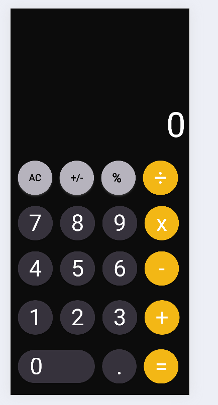

****iPhone Calculator Clone - Flutter****

This project is a Flutter application that aims to recreate the user interface and functionality of the iPhone calculator app specifically tailored to the dimensions of iPhone 12 Pro.

**Description**

This Flutter project is a clone of the native iPhone calculator app. 
It replicates the look and feel of the iPhone calculator, ensuring it fits perfectly within the dimensions of an iPhone 12 Pro screen. The app is built using Flutter, a popular UI toolkit for building natively compiled applications for mobile, web, and desktop from a single codebase.

**Features**

Replicates the user interface of the native iPhone calculator app.
Supports basic arithmetic operations such as addition, subtraction, multiplication, and division.
Implements the standard functionality of a calculator including percentage calculation and clearing the input.
Designed to match the dimensions of iPhone 12 Pro, ensuring an optimal user experience.

**Getting Started**

To run this application locally, follow these steps:

Make sure you have Flutter installed on your machine. If not, follow the instructions here.
Clone this repository to your local machine.
Open the project in your preferred code editor.
Ensure you have a device simulator installed for iPhone 12 Pro dimensions, or connect a physical iPhone 12 Pro device to your machine.
Run the command flutter run in your terminal from the project directory.
The application should build and launch on your selected device or simulator.

**Screenshots**

**Clone:**
https://github.com/sameerhussain3211/IOS-CALCULATOR